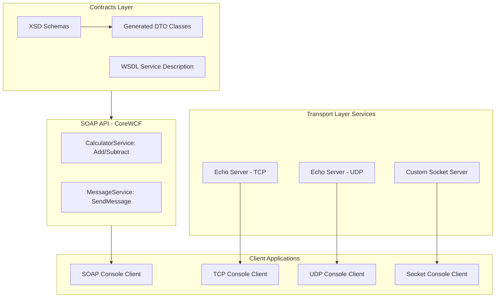

# 1. Mermaid Diagram of the Whole Learning Project

---

# 2. Explanation of Each Part

### **Contracts Layer**

* Holds **XSDs** (schemas for request/response messages).
* From XSDs, you generate **DTO classes** (C#).
* Contains the **WSDL** definition that describes the SOAP service contract.

### **SOAP API (CoreWCF)**

* Built with **CoreWCF** on .NET 8.
* Exposes **CalculatorService** and **MessageService** as SOAP endpoints.
* Generates WSDL automatically for clients.

### **Transport Services (TCP/UDP/Socket)**

* **TCP Service**: Connection-oriented echo server.
* **UDP Service**: Connectionless, fast echo for small datagrams.
* **Socket Service**: Lower-level demo of raw socket communication.

### **Client Applications**

* **SOAP Client**: Console app consuming SOAP API using generated proxy classes.
* **TCP Client**: Console app that connects to TCP echo server.
* **UDP Client**: Console app that sends/receives datagrams.
* **Socket Client**: Console app that uses raw socket to communicate.

---

# 3. Plan to Build This Project (Execution Roadmap)

### **Step 1 – Setup Solution Structure**

* Create solution `LearningServices.sln`.
* Add projects:

  * `Contracts` (Class Library).
  * `SoapApi` (Web project with CoreWCF).
  * `TcpService`, `UdpService`, `SocketService` (Console apps).
  * `Clients` (Console apps).

### **Step 2 – Contracts**

* Write XSDs for Calculator and Message requests/responses.
* Generate DTOs via `dotnet xscgen`.
* Place WSDL file in `Contracts`.

### **Step 3 – SOAP API**

* Add **CoreWCF.Http** package.
* Implement `CalculatorService` and `MessageService`.
* Configure WSDL exposure in `Program.cs`.

### **Step 4 – TCP/UDP/Socket Services**

* Create lightweight servers:

  * **TCP**: Use `TcpListener`/`TcpClient`.
  * **UDP**: Use `UdpClient`.
  * **Socket**: Use raw `Socket`.
* Implement simple echo (client sends “Hello”, server replies “Hello back”).

### **Step 5 – Clients**

* SOAP Client: Use `dotnet svcutil` to generate proxy from WSDL.
* TCP/UDP/Socket Clients: Console apps that send and receive messages.

### **Step 6 – Integration**

* Ensure all services can run in parallel (different ports).
* Save logs in PostgreSQL (messages, service calls).

### **Step 7 – Documentation**

* Generate Mermaid diagrams.
* Document contracts (XSD/WSDL).
* Write README explaining scope and differences between SOAP/TCP/UDP.

---

# 4. Which Template to Use in .NET 8

* **SOAP API (CoreWCF)** → `dotnet new web`
  (CoreWCF runs inside ASP.NET Core’s hosting model).

* **Contracts Project** → `dotnet new classlib`

* **TCP/UDP/Socket Services** → `dotnet new console`

* **Clients** → `dotnet new console`

---

# Key Things You’ll Learn

* How to create a **SOAP service** in .NET 8 with WSDL & XSD contracts.
* How to **consume SOAP** from .NET clients.
* How TCP, UDP, and raw Sockets differ in real implementations.
* Basics of **CoreWCF** (modern WCF-like programming model).