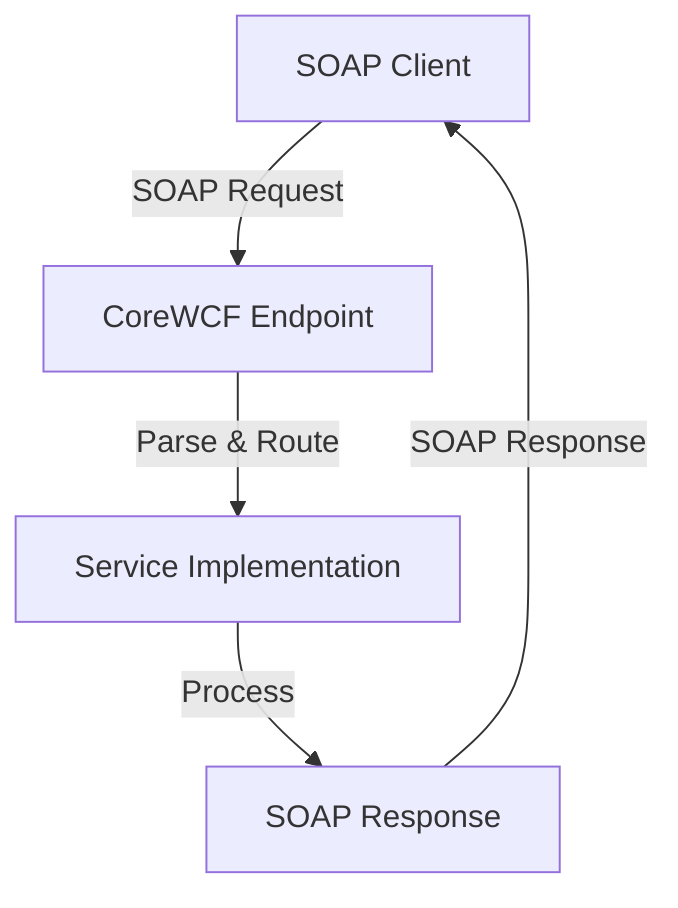
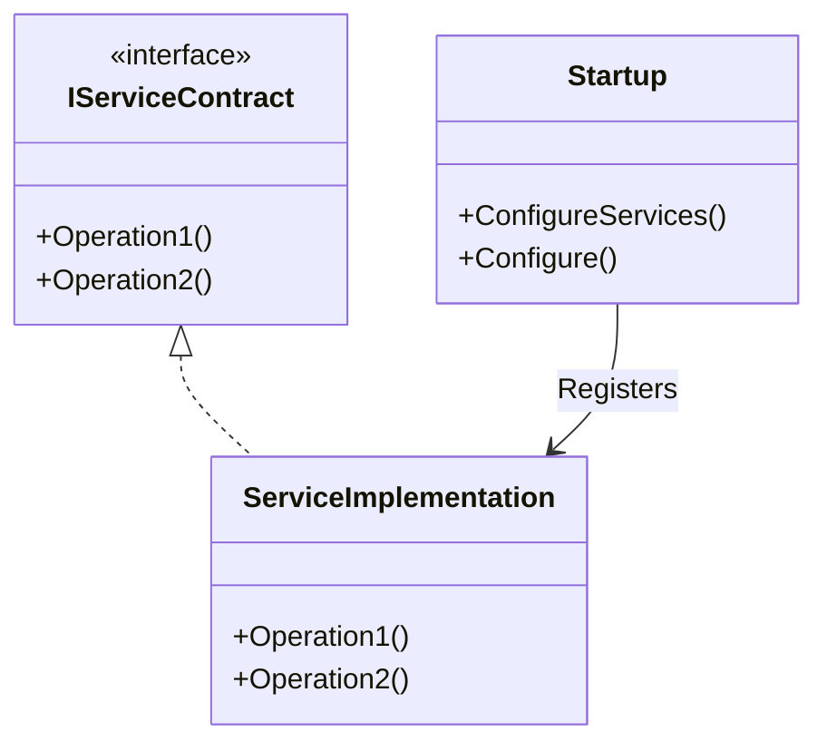

# dotnet-services (CoreWCF SOAP API PoC)

## What is CoreWCF?

CoreWCF is a community-driven port of Windows Communication Foundation (WCF) to .NET Core and .NET 5/6+. It enables building SOAP-based web services in modern .NET environments, supporting interoperability, security, and extensibility.

### Why Use CoreWCF?

- **Interoperability:** Communicate with legacy systems and other platforms using SOAP.
- **Extensibility:** Customize bindings, behaviors, and service contracts.
- **Modern .NET:** Run on Linux, Windows, and containers.

## How Does CoreWCF Work?

CoreWCF exposes services using endpoints, bindings, and contracts:

- **Service Contract:** Defines the operations (methods) available.
- **Service Implementation:** Implements the contract.
- **Endpoint:** Specifies the address, binding (protocol), and contract.
- **Binding:** Defines how messages are transmitted (e.g., HTTP, TCP).
- **Host:** Runs the service (e.g., ASP.NET Core app).

When a client sends a SOAP request, CoreWCF parses the XML, invokes the corresponding method, and returns a SOAP response.

## How SOAP API Works (Flow Diagram)



## Example: SOAP API Class Structure



- `IServiceContract`: Interface defining SOAP operations.
- `ServiceImplementation`: Implements the contract.
- `Startup`: Configures CoreWCF and registers the service.

## Repository Purpose

This repo demonstrates:

- How to implement SOAP APIs using CoreWCF in .NET.
- How to structure service contracts, implementations, and hosting.
- How to run and test SOAP services locally or in containers.

## Getting Started

1. **Restore dependencies:**
   ```sh
   dotnet restore src/ugly.brocolly.sln
   ```
2. **Build the solution:**
   ```sh
   dotnet build src/ugly.brocolly.sln
   ```
3. **Run the service:**
   ```sh
   dotnet run --project src/SoapApi/Soap.Api.csproj
   ```

## Key Files

- `src/SoapApi/`: Main SOAP API implementation.
- `src/Directory.Packages.props`: Central NuGet management.
- `src/ugly.brocolly.sln`: Solution file.

## Learn More

- [CoreWCF GitHub](https://github.com/CoreWCF/CoreWCF)
- [SOAP Protocol](https://www.w3schools.com/xml/xml_soap.asp)
